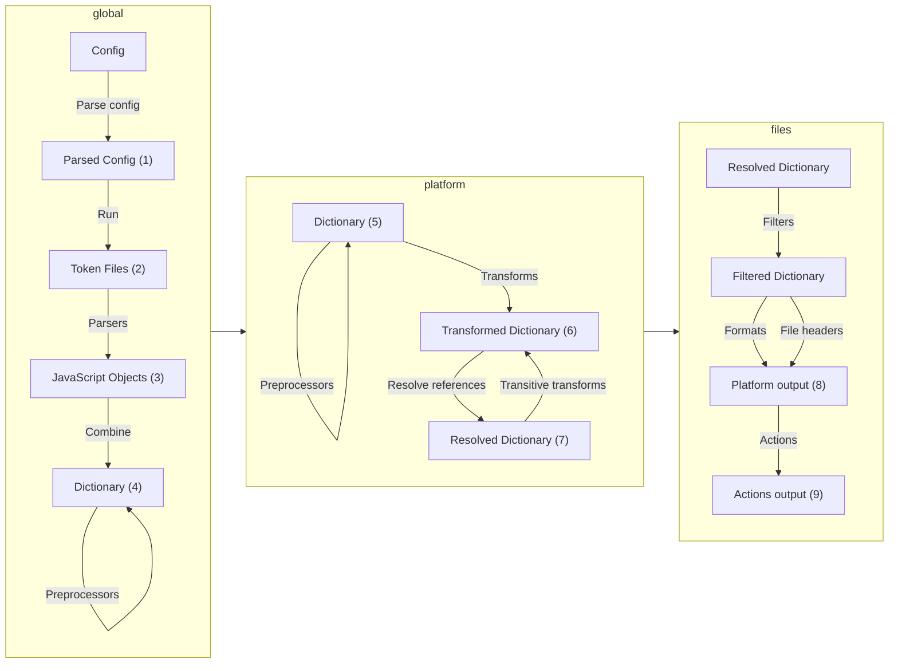

This is how Style Dictionary works under the hood:

Let's take a closer look into each of these steps.

## 1. Parse the config

Style Dictionary is a configuration based framework, you tell it what to do in a configuration file. Style Dictionary first parses this [configuration](/reference/config) to know what to do.

## 2. Find all token files

In your [config](/reference/config) file can define `include` and `source`, which are arrays of file path globs. These tell Style Dictionary where to find your token files. You can have them anywhere and in any folder structure as long as you tell Style Dictionary where to find them.

## 3. Parse token files

If there are [custom parsers](/reference/hooks/parsers) defined and applied in the config, Style Dictionary will run those on files the applied parsers match. For JSON or JavaScript token files, those are parsed automatically through built-in parsers.

## 4. Deep merge token files

Style Dictionary takes all the files it found and performs a deep merge. This allows you to split your token files in any way you like, without worrying about accidentally overriding groups of tokens. This gives Style Dictionary a single, complete token object to work from.

## 5. Run preprocessors over the dictionary

Allows users to configure [custom preprocessors](/reference/hooks/preprocessors), to process the merged dictionary as a whole, rather than per token file individually.
These preprocessors have to be applied in the config, either on a global or platform level.
Platform level preprocessors run once you get/export/format/build a platform, at the very start.
Note that [tokens expansion](/reference/config#expand) runs after the user-configured preprocessors (for both global vs platform configured, respectively).

## 6. Transform the tokens

Style Dictionary now traverses over the whole token object and looks for design tokens. It does this by looking for anything with a `value` key. When it comes across a design token, it then performs all the [transforms](/reference/hooks/transforms) defined in your [config](/reference/config) in order.

Value transforms, transforms that modify a token's value, are skipped if the token references another token. Starting in 3.0, you can define a [transitive transform](/reference/hooks/transforms#transitive-transforms) that will transform a value that references another token after that reference has been resolved.

## 7. Resolve aliases / references to other values

After all the tokens have been transformed, it then does another pass over the token object looking for aliases, which look like `"{size.font.base}"`. When it finds these, it then replaces the reference with the transformed value. Because Style Dictionary merges all token files into a single object, aliases can be in any token file and still work.

## 8. Format the tokens into files

Now all the design tokens are ready to be written to a file. Style Dictionary takes the whole transformed and resolved token object and for each file defined in the platform it [formats](/reference/hooks/formats) the token object and write the output to a file. Internally, Style Dictionary creates a flat array of all the design tokens it finds in addition to the token object. This is how you can output a flat SCSS variables file.

Formats receive token values verbatim — Style Dictionary does not escape or quote a value for the target syntax, so the value is the trust boundary for whatever a format writes. That also means a value adaptation added for one output syntax only applies where it is actually reached: the CSS-family variable formats (`css`, `scss`, `less`, `stylus`) share a single property formatter, but other templates inline values directly, and JSON/JavaScript outputs intentionally carry values untouched. When every output must agree on how a value is written, that belongs in a [transform](/reference/hooks/transforms), not a format.

Verbatim embedding extends to markup outputs: the static style-guide template and `markdown/tables` write names and values straight into HTML and Markdown with no HTML sanitization. That is deliberate — token files are operator-authored build config at the same trust level as `buildPath` or the JS config module itself, so a generated docs page is only as safe as the sources it was built from. Syntax safety is still the format's job: a value may contain characters that break the target syntax, and the format must wrap or escape those without assuming the value is well-formed.

Paths are canonical posix throughout this step. `platform.buildPath` and a file's `destination` accept either `/` or `\`, are normalized to `/` before being joined, and the joined string is what gets both written to disk and reported in the log — so two configs differing only in separator style, or only in whether `buildPath` has a trailing separator, build identically. The clean code path (`cleanFile`/`cleanDir`) derives its destinations the same way, because it can only remove and prune what the build path actually wrote; a separator difference between the two would leave built files behind.

Formatting is concurrent. `formatPlatform` formats a platform's files with `Promise.all`, and `formatAllPlatforms` formats the platforms the same way, so files and platforms do not finish in config order. Anything that has to be attributed to one file or platform therefore cannot live in process-wide state: whichever concurrent task reads a shared value first takes whatever its siblings wrote into it, and the attribution then shifts with unrelated async timing — a sibling gaining a filter, for instance, adds ticks that change who arrives first. Per-file state belongs on the object graph of the file being formatted.

Formatting is also where filtered-out-reference warnings are reported. Each file owns its collector — created by the file-formatting step and reachable from the format as `dictionary.filteredReferences` — so a file reports only the warnings it recorded itself, and the references it lists are exactly the ones that file's own filter excluded. A lookup that only inspects tokens — the reference-safe ordering pass that runs whenever `outputReferences` is set, or an `outputReferences` predicate deciding whether to emit — must not record one, because a warning recorded for a token that is never formatted is never cleared and is then reported as a false positive for the whole file.

Rewriting references is the other place where the shape of a token matters. A scalar token's value still holds the reference syntax (`{path.to.token}`) at this point, so references can be replaced positionally by that syntax. An object/array-valued token has already been flattened to a string, so its references are found by matching each reference's resolved value in that string — and the output is only correct if every reference keeps its own slot at its own position. That requires matching against a snapshot of the value taken before any replacement, with the replacements applied afterwards; replacement text can contain the matched value (`var(--ref, 0)` with `outputReferenceFallbacks`), so searching the string as it is being rewritten lets a later reference match inside the fallback just emitted for an earlier one. Resolved values are also not unique — several references in one composite value routinely resolve to the same string — so an occurrence may be claimed by only one reference, and none may be dropped or collapsed into another.

## 9. Run actions

[Actions](/reference/hooks/actions) are custom code that run in a platform after the files are generated. They are useful for things like copying assets to specific build directories or generating images.

After Style Dictionary does steps 4a-4d for each platform, you will have all your output files that are ready to consume in each platform and codebase.
